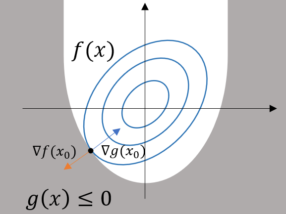

> 部分理论知识的推导证明有待后续学习补充

## 拉格朗日乘子法

在解决有约束的最优化问题时，往往需要利用拉格朗日乘子法引入参数转为无约束的问题解决，因此有必要了解这个重要的优化方法。

### 数学基础知识

#### 全微分

全微分描述的是多元函数整体的线性增量情况。对于多元函数$f(\boldsymbol{x})$,全微分可以写为：
$$
f(\boldsymbol{x}+\Delta \boldsymbol{x})-f(\boldsymbol{x}) = L(\Delta \boldsymbol{x})+o(\Delta \boldsymbol{x}^2)\\
L(\Delta{\boldsymbol{x}}) = \nabla f(\boldsymbol{x})^T \boldsymbol{x} = \frac{\partial f}{\partial x_1}\Delta x_1 + \frac{\partial f}{\partial x_2}\Delta x_2+...+\frac{\partial f}{\partial x_m}\Delta x_m
$$
全微分对一个点增量的描述情况从线性阶数角度是不区分方向的（因存在二阶无穷小量$\Delta \boldsymbol{x}^2$)，描述的是多元函数$f(\boldsymbol{x})$在某个位置的增长情况。

#### 曲面的梯度与切平面

切线从定义上就是一个与导数密切相关的内容，因此主要考虑其方向（也即切向量）。对于任意广义曲线的参数方程$[\theta(t),\phi(t),\psi(t)]$ (这里以空间曲线为例），其在位置$t_0$的切向量即$\begin{align}[\frac{\partial \theta}{\partial t},\frac{\partial \phi}{\partial t},\frac{\partial \psi}{\partial t}]|_{t=t_0} \end{align}$, 

> 切线的导数意义很好理解，切线从参数方程的角度也就是形容$t_0$到$t_0+\Delta t$潜在的变化方向，与导数同意义

对于广义曲面$f(\boldsymbol{x})=0$, 不妨以$f(x,y,z)=0$的空间曲面为例，可得对于任意的曲面上的曲线$[\theta(t),\phi(t),\psi(t)]$ ，以$t$为参数做全微分，可得**全微分应当为0**
$$
\begin{align}
L(\Delta t)_{t=t_0} 
&= \frac{\partial f}{\partial \theta}\frac{\partial \theta}{\partial t}\Delta t + \frac{\partial f}{\partial \phi}\frac{\partial \phi}{\partial t}\Delta t + \frac{\partial f}{\partial \psi}\frac{\partial \psi}{\partial t}\Delta t\\ &= 
(\frac{\partial f}{\partial \theta}\frac{\partial \theta}{\partial t} + \frac{\partial f}{\partial \phi}\frac{\partial \phi}{\partial t} + \frac{\partial f}{\partial \psi}\frac{\partial \psi}{\partial t})\Delta t =0\\

\end{align}
$$
也即$[\frac{\partial f}{\partial \theta},\frac{\partial f}{\partial \phi},\frac{\partial f}{\partial \psi}] \begin{bmatrix} \frac{\partial \theta}{\partial t} \\ \frac{\partial \phi}{\partial t} \\ \frac{\partial \psi}{\partial t} \end{bmatrix} = 0$对于任意的过$t_0$的曲线$[\theta(t),\phi(t),\psi(t)]$都有梯度向量和曲线在该点的方向向量（切向量）正交，也即曲面$f(\boldsymbol{x})=0$在$\boldsymbol{x}_0$处的梯度$\nabla f(\boldsymbol{x})$就是曲面在该点的法向量，也即在该点的切平面的法向量（任意一条曲线$[\theta(t),\phi(t),\psi(t)]$在$t=t_0$的方向向量都属于该点的切平面）

### 拉格朗日乘子法

对于一般的有约束优化问题（目前先讨论只有一个约束的情况），有
$$
\min_\boldsymbol{x} f(\boldsymbol{x}),\quad s.t. g(\boldsymbol{x})=(\leq)0
$$
因此分别讨论约束为等于的情况以及约束为不等的情况两种情况。

#### 约束为相等约束

知道$g(\boldsymbol{x})=0$以及$f(\boldsymbol{x})=m$两个广义曲面，因$g(\boldsymbol{x})=0$作为约束，从而$g(\boldsymbol{x})=0,f(\boldsymbol{x})=m$两个曲面一定相交，**在这种情况下出现极值时，一定出现在两个曲面相切的位置**，结合上述的法向量的推导可知，曲面某点的法向量为梯度，则**两个曲面相切的位置梯度共线**。也即$\nabla f(\boldsymbol{x}) +\lambda \nabla g(\boldsymbol{x}) = 0$存在时$\boldsymbol{x}$位置取得极值.此时有$\boldsymbol{x}$的约束：
$$
\left\{
\begin{align}
\nabla f(\boldsymbol{x}) +\lambda \nabla g(\boldsymbol{x}) = 0\\
g(\boldsymbol{x}) = 0
\end{align}
\right.
$$
上式又可以写为函数求极值求导为0的形式
$$
\left\{
\begin{align}
\partial (f(\boldsymbol{x})+\lambda g(\boldsymbol{x}))\frac{1}{\partial \boldsymbol{x}} = 0\\
\partial (f(\boldsymbol{x})+\lambda g(\boldsymbol{x}))\frac{1}{\partial \lambda} = 0\\
\end{align}
\right.
$$
也即求约束问题$\min_\boldsymbol{x} f(\boldsymbol{x}),\quad s.t. g(\boldsymbol{x})=0$的极值本质上与求无约束问题$L(\boldsymbol{x},\lambda) = f(\boldsymbol{x})+\lambda g(\boldsymbol{x})$的极值是一致的，(**注意这里的$g(\boldsymbol{x})$是函数形式的一部分，不再是前面那个需要为0的约束**)从而将有约束的极值问题处理为了无约束的极值问题。注意这里$\lambda$的正负尚不清楚。

#### 约束为不等约束

当约束变为$\min_\boldsymbol{x} f(\boldsymbol{x}),\quad s.t. g(\boldsymbol{x})\leq0$时则存在两种情况，**一种是最优点在约束的区域内，另一种是最优点在约束的边界上。**

- **对于在区域内的情况**，相当于用没有$g(\boldsymbol{x})\leq 0$的约束求极小值和有这个约束求极小值没有区别，也即$\frac{\partial f}{\partial \boldsymbol{x}}=0$，此时可以继续写为：
  $$
  \partial (f(\boldsymbol{x})+\lambda g(\boldsymbol{x}))\frac{1}{\partial \boldsymbol{x}} = 0, \lambda=0
  $$
  即是对$L(\boldsymbol{x},\lambda) = f(\boldsymbol{x})+\lambda g(\boldsymbol{x})|_{\lambda=0}$求极值，

- **对于边界上的情况**，则与$g(\boldsymbol{x})=0$的等式约束是一样的。同样为
  $$
  \left\{
  \begin{align}
  \partial (f(\boldsymbol{x})+\lambda g(\boldsymbol{x}))\frac{1}{\partial \boldsymbol{x}} = 0\\
  \partial (f(\boldsymbol{x})+\lambda g(\boldsymbol{x}))\frac{1}{\partial \lambda} = 0\\
  \end{align}
  \right.
  $$
  同时有对于不等式的情况，$\lambda$的取值并不是$\lambda \neq 0$而是$\lambda > 0$，表示$g(\boldsymbol{x})$与$f(\boldsymbol{x})$的法向量方向必须相反

  

  因为$\nabla f(\boldsymbol{x})$表示的是函数最大的增长方向（参考方向导数的定义），因此沿梯度方向函数上升。对于$g(\boldsymbol{x})$,$g(\boldsymbol{x})=0$一定指向可行域外，因为可行域内是小于号，对于$f(\boldsymbol{x})$，边界上是最小值，因此梯度一定指向可行域内，从而一定会有两个梯度反向。

- **最优值在边界上与在边界内的统一情况**，二者虽然都是求$L(\boldsymbol{x},\lambda) = f(\boldsymbol{x})+\lambda g(\boldsymbol{x})$的极值，不过对于边界内情况，$\lambda=0$, 对于边界上情况$\lambda>0$, 且对于边界上情况最优解一定在边界上，满足$g(\boldsymbol{x})=0$, 因而得到不等式情况下的拉格朗日乘子法最优解存在时的条件，即
  $$
  \left\{\begin{align}
  \lambda \geq 0\\
  g(\boldsymbol{x}) \leq 0\\
  \lambda g(\boldsymbol{x})=0 \end{align}
  \right.
  $$
  

  **注意**：$\lambda g(x)=0$并不是说$L(\boldsymbol{x},\lambda) = f(\boldsymbol{x})+\lambda g(\boldsymbol{x})=f(\boldsymbol{x})$了，**上面的三个条件是最优解条件，表示取到最优解时上述三个条件一定成立**。而$L(\boldsymbol{x},\lambda)$的极值还是要按导数条件正常求的。**上述的三个条件称为$KKT$条件。**

#### 不等式约束的实际应用情况

$KKT$条件在某些情况下可以直接参与构成充要条件用于求解最优值，（即能够确定**当且仅当**$KKT$与某些其他条件满足时一定能够得到最优答案）

从而将问题转变为一个以$\lambda$为变量解方程的问题（$\boldsymbol{x} = \boldsymbol{x}(\lambda)$进而求得最优的位置）

$eg:$

对于二阶泰勒展开函数$m(d) = f + g^Td+\frac{1}{2}d^TBd$，求解其在变化邻域$\|d\|\leq \Delta$的限制下的最小值（也就是求解信赖域问题时需要求解的子问题），即需要用拉格朗日乘子法结合$KKT$条件进行求解。

结论：$\min_d m(d) = f + g^Td+\frac{1}{2}d^TBd \quad s.t. \|d\|\leq \Delta$这个有约束的最优化问题的全局极小解出现在当且仅当$d^*$可行且存在$\lambda \geq 0$, 使得：
$$
\left\{
\begin{align}
(B+\lambda I)d^* + g = 0 & \quad (1)\\
\lambda(\Delta - \|d^*\|) = 0 & \quad (2)\\
(B+\lambda I)\geq 0 & \quad (3)
\end{align}
\right.
$$
假设这个问题的约束条件为$\frac{1}{2}(\|d\|^2 - \Delta^2)\leq 0$（与模长约束等价），则根据拉格朗日乘子法写出$L(d,\lambda)$与$KKT$条件，可得：
$$
\begin{align}
L(d,\lambda) &= f+g^Td+\frac{1}{2}d^TBd - \frac{\lambda}{2}(\Delta^2 - d^Td)\\
&= f + g^Td + \frac{1}{2}d^T(B+\lambda I)d
\end{align}
$$
$KKT$条件的$\lambda g(d)=0$即对应了$\lambda(\Delta - \|d^*\|) = 0  \quad (2)$式，而$L(d,\lambda)$对$d$的倒数在最优点处取得0可依据上述的$L(d,\lambda)$得到$(1)$式，剩下约束条件较强的$(3)$式，其必要性相对好证明（但充分性不易证明，需要补充正定矩阵的相关知识）

因为$(1),(2)$式都是充分和必要性可以同时得到的式子，因此证明$(3)$式的必要性时能够直接默认$(1),(2)$式成立，假设对于任意$\|d\|=\Delta\quad (2)$以及最优的$d^*$,有$L(d,\lambda)\geq L(d^*,\lambda)$,即
$$
m(d)+\frac{\lambda}{2}d^Td \geq m(d^*)++\frac{\lambda}{2}d^{*T}d^* \\
g^T(d-d^*)+\frac{1}{2}d^T(B+\lambda I)d \geq \frac{1}{2}{d^*}^T(B+\lambda I)d^*
$$
对于二阶梯度矩阵$B$有$B$对称（连续可微的函数$\frac{\partial^2f}{\partial x_i\partial  x_j} = \frac{\partial^2f}{\partial x_j\partial  x_i}$,Hessian矩阵是对称的），再根据$g^T = -((B+\lambda I)d^*)^T = -d^{*T}(B+\lambda I)^T = -d^{*T}(B+\lambda I)$，化简上述式子则可以得到
$$
g^T(d-d^*)+\frac{1}{2}d^T(B+\lambda I)d \geq \frac{1}{2}{d^*}^T(B+\lambda I)d^* \\
d^{*T}(B+\lambda I)(d^*-d)+\frac{1}{2}d^T(B+\lambda I)d - \frac{1}{2}{d^*}^T(B+\lambda I)d^* \geq 0\\
-d^{*T}(B+\lambda I)d + \frac{1}{2}d^T(B+\lambda I)d + \frac{1}{2}{d^*}^T(B+\lambda I)d^*
$$
因为$d^{*T}(B+\lambda I)d$是标量，转置等于自己，其转置为$d^{T}(B+\lambda I)d^*$, 因此对其进行拆解带入上式能够得到
$$
\frac{1}{2}(d-d^*)^T(B+\lambda I)(d-d^*) \geq 0
$$
也即条件$(3)$的半正定条件，结合半正定矩阵的特性可以反之证明充分性，即当有满足条件的$\lambda$使得$(1),(2),(3)$存在时，$\lambda$对应的$d(\lambda)$就是最优值，从而能够构造一个$d(\lambda) = \Delta$的单调方程，利用数值方法求解$\lambda$进而求得$b(\lambda)$, 此即求解这个二阶泰勒展开带约束的最优化求解方法。