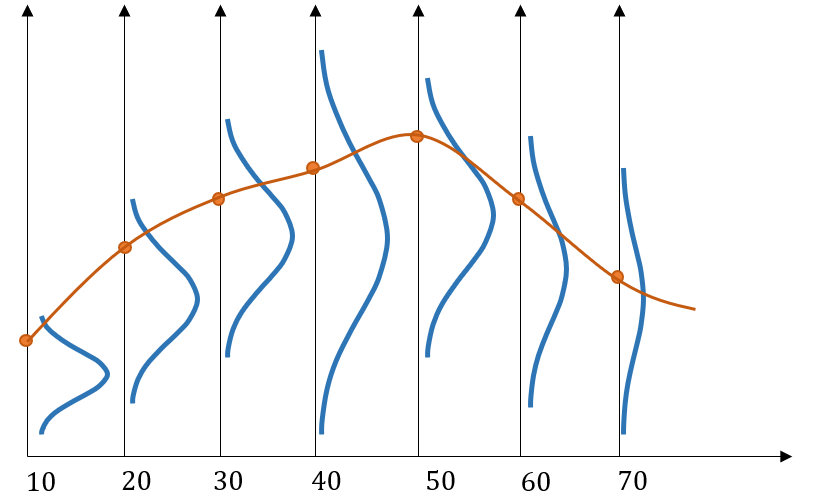
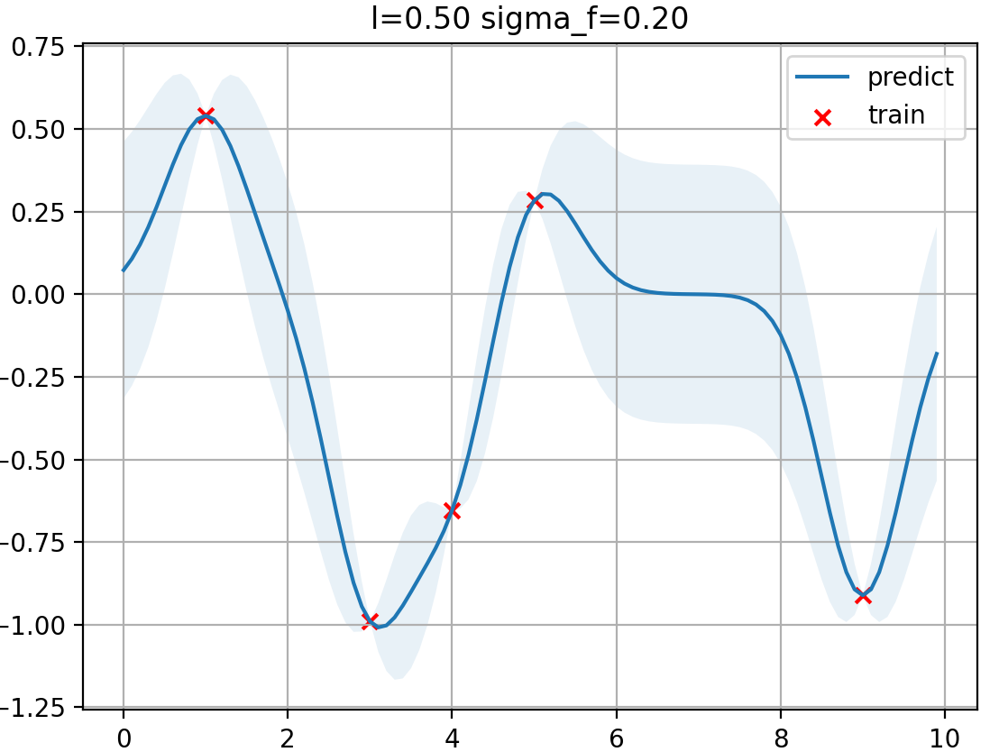

> 注：高斯过程是个**机器学习中的概念**，在SLAM的地图表示中具有独特的意义，因此本文的重点是分析高斯过程在SLAM中的性质。

## Gaussian Process

占据栅格的原理使之很难脱离ID的离散空间，虽然之前阅读的Generic NDT Mapping这篇论文中提出了利用正态分布（$\mu,\Sigma$）+ 八叉树栅格来表示更为精细的地图（hybrid NDT-octomap)，并提出了基于正态分布的1D连续空间的地图更新函数，我们也意识到在更高维空间的地图表示具备的解析形式过于复杂，高斯过程很好地解决了这一难题，使得地图在空间中的表示具备更加连续的特质，并提供了一种非机械式地划分occupied & free space的方法，许多思想值得借鉴。

### 什么是高斯过程

用一个例子引入，假设人在一生中的各个年龄段的体力值都满足正态分布，则一个人一生的体力值的连续变化就是一个高斯过程（Gaussian Process), 从另一种角度说，一个人一生的体力值变化是体力值这个与时间（横轴）相关的**正态分布的函数**$f(t) = \mathcal{N}(\mu,\Sigma),\mu=\mu(t), \Sigma = \Sigma(t)$的**一个无限维连续采样**。它具有以下性质：

- **函数的分布**：这里的一个样本是某个人（也就是单个函数），而样本集合是所有人（所有在这个正态分布规律下的函数），即这些函数拥有一个期望$\mu(t)$（当然也是一个函数）和一个描述波动的量$\Sigma$（类比协方差矩阵）

- **连续**：样本函数是连续的，意味着单个样本的分布在x轴上是关联的（比如一个人小时候身体很好，那么它在后续成长过程中一定受到这种影响，可能整个曲线都在分布期望之上）

> 连续性意味着**我们不能简单地用$\mathcal{N}(\mu(t),\Sigma(t))$来描述这个过程**，虽然协方差确实也是时间的函数，但每个连续样本并不是说每个时刻$t_0$就按$\mu_{t0},\Sigma_{t0}$进行一个采样，拼起来就可以了，这样肯定是不连续的，也无法体现相互影响，离散地理解，下个采样时刻的可行区间一定是受上个时刻的实际值**距离上的约束**的，在定义高斯过程的“协方差”时我们能看到这点

### 定义一个高斯过程

期望$\mu(t)$是显而易见的，我们用核函数$k(s,t)$来描述上一节说到的连续性约束。

在机器学习中，核函数$k(x,x*) = \phi(x)^T\phi(x*)$用于数据升维，利用$\phi(x)$将$x$升维，从而使得原先线性不可分的$x$升为$\phi(x)$后线性可分，核函数主要用于描述$\phi(x)$的内积，以提供计算的便捷，联系内积可以得到另一个核函数的性质：

- 对于$k_{ij} = k(x^{(i)},x^{(j)})$构成的矩阵$K_{m\times m}$,($x=[x_1,x_2,...,x_m]$), 若$K_{m\times m}$半正定，$k(x,x*)$是有效核函数

在这里我们不讨论$k(x,x*)$在创建分类面中的做用，而是应该注意到$k(x,x*)$是个$x,x*$**距离--值关系的度量**。像机器学习中常用的多项式核函数$k(x,x*)=(x^Tx*+I)^p$和一些常用的带超参数的核函数：

- 径向基函数RBF：

$$
k(s,t) = \sigma^2 \exp(-\|s-t\|^2/2l^2)
$$

- matern核函数：

$$
k(r)|_{r=\|s-t\|} = \sigma_f^2(1+\frac{\sqrt{3}r}{l})\exp(\frac{-\sqrt{3}r}{l})
$$

注意到高斯过程用这些与距离$\|s-t\|^2$相关的核函数，实际上表示的就是延拓方向上（如上一节的例子就是$x$轴时间）距离对连续函数取值区间的约束程度，高斯过程采用$\|s-t\|^2$与$k(s,t)$负相关的核函数，也就是意味着**距离越远的采样对当前区间的约束能力越弱。**

因此notation上高斯过程可以描述为：
$$
f(x) \sim \mathcal{GP}(\mu(x),k(x,x*))
$$

### 高斯过程的回归

高斯过程的$k(s,t)$是经验给定，在区间上一致的，而$\mu(t)$的形式与其拟合的数据相关，对高斯过程加数据的过程在机器学习中叫训练，不过这里更愿意将其称为回归（regression).

对于没有任何数据观测支撑的高斯过程$f(x) \sim \mathcal{GP}(\mu(x),k(x,x*))$, 其类似一个多元高斯分布（不过这里是无限元的），结合多元分布的性质，在有数据支撑后，原本的分布可以变为条件高斯分布$p(x_b|x_a)$, 结合多元高斯分布的条件分布（看Istatic的笔记）
$$
\mu_{b|a} = \Sigma_{ba}\Sigma_{aa}(x_a-\mu_a)+\mu_b\\
\Sigma_{b|a} = \Sigma_{bb} - \Sigma_{ba}\Sigma_{aa}^{-1}\Sigma_{ab}
$$
对于高斯过程也是同理的，高斯过程的回归本质上也是在拿到观测数据（也就是样本函数的几个位置的函数值）后求一个条件概率函数（是不是很像贝叶斯滤波），用分块矩阵写出来即是
$$
\begin{align}
\begin{bmatrix}
Y\\X*
\end{bmatrix}
\sim \mathcal{GP}(
\begin{bmatrix}
\mu(X)\\
\mu(X*)
\end{bmatrix}
,
\begin{bmatrix}
k(X,X) & k(X,X*)\\
k(X*,X) & k(X*,X*)
\end{bmatrix}
)
\end{align}
$$
其中$[X,Y]$就是观测（已知的函数值），注意到这是一组数据。基于这些观测值推导的函数即条件概率函数$f(X*)|Y \sim \mathcal{GP}(\mu*, k*)$。进一步可以写出期望函数和核函数基于条件概率的推导公式：
$$
\begin{align}
\mu* = k(X*,X)k(X,X)^{-1}(Y-\mu(X))+\mu(X*)\\
k* = k(X*,X*)-k(X*,X)k(X,X)^{-1}k(X,X*)
\end{align}
$$
这里就是把条件概率的式子套到高斯过程中，协方差矩阵$\Sigma_{ij}$用核函数矩阵$k_{ij}$替代，期望用期望函数替代。我们着重分析观测点及其附近的$\mu*,k*$情况。

- **在$X$点上**：
  - $\mu* = \mu(X*)+Y-\mu(X) = Y$, 即期望函数一定越过观测点，即$\mu(x)$的函数曲线是由观测点完全控制的
  - $k*=k(X,X)-k(X,X)k(X,X)^{-1}k(X,X)=0$, 此时是固定的，即$[X,Y]$就是给定的，不会存在波动
- **在$X$点附近**：
  - $k(X*,X)$核函数的影响，越近则值与$Y$越接近，越远则$[X,Y]$的影响越小，与原先的先验值越接近。（这是个类似插值的函数模式，从而**函数的形状很大程度上受$k(X*,X)$的函数形式影响**）
  - 由于$k(X,X*),k(X*,X)$的转置关系，在$X$附近离$X$越远，$k(X*,X)k(X,X)^{-1}k(X,X*)$越大，$k*$越大，波动会越大

参考本文档的配套代码`gpVisualize.py`能够感受到这种数值上直观的描述：

>我们讨论过$k$与$\Sigma$表述的意义并不是完全一样的，代码中的置信区间利用$k$值大小绘制，呈现出$k$越大置信区间越宽的特点，但在高斯过程中，$k$更多表示的是其对周围点的**控制力（控制区间的能力）**，二者在大小关系上同样是一致的.

- **$k$比较大的时候**，很远的点也能在当前位置有很大的控制力，意味着当前位置可能在远处的任何一个点控制的区间里，**表现为高不确定性**
- **$k$比较小的时候**，说明更远处的点几乎不影响这个位置，则怎么像期望怎么来，**表现为高确定性**

### 基于高斯过程的SLAM描述