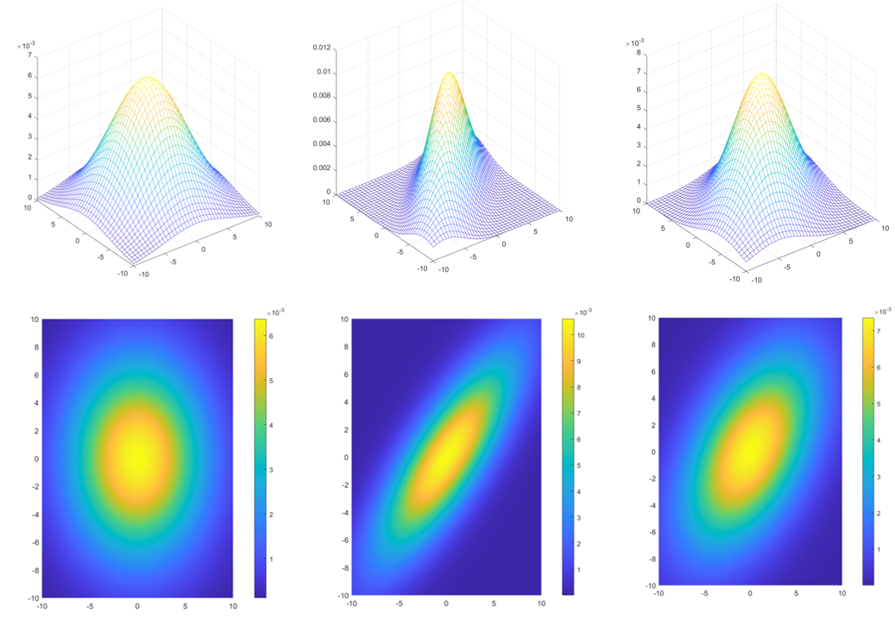

## 多元正态分布

> 注意：由于专业影响，在这里讨论随机变量时将忽略随机事件作为概率学因素的讨论，而是**侧重于样本作为概率学因素的讨论**
>
> 同时注意：$Ap=\lambda p$的特征值形式在不同的场合使用意义不同，**视场合而定，一定不能牵强附会**

### 协方差

在统计学中，随机变量$X,Y$的协方差被定义为：
$$
Cov(X,Y) = E[(X-E(X)(Y-E(Y)))]
$$
与方差$Var(X)=E[(X-E(X))^2]$定义方式相同，满足如下性质：

- $Cov(X,Y)=Cov(Y,X)$
- $Cov(X,X) = Var(X)$
- $abCov(X,Y) = Cov(aX,bY)$

其本质上是描述的$X,Y$**线性趋势的一致程度**（相关系数$\rho = \frac{Cov(X,Y)}{Var(X)Var(Y)}$）则是除去了方差的尺度影响，单纯表示线性相关的程度），至于为什么是$X,Y$的线性关系，给出一种粗略的理解：

$Var(X)$之所以有那种方程的形制，因为其本质上是用来描述样本沿$X$方向的分布是集中的还是分散的。现在将$Var(X)=E[(X-E(X))^2]$中的一个地方换成$Y-E(Y)$, 则其**值**因为本质仍是体现$(X-E(X))$的平方关系来继续作为一个衡量集中还是分散的统计量，使得其**值**受$Y-E(Y),X-E(X)$线性程度的影响。因此**协方差的值的意义**不可避免的是与$X,Y$的线性程度挂钩的。

> 这有助于理解为什么**协方差矩阵**是一个有能力体现**方向性**且能够带入广义椭圆的几何意义去理解的统计量

对于一组样本点（向量）$X=[x_1,x_2,x_3,...x_m]^{(i)}_{i\in[1,N]}$, 根据统计学的知识能够得到每个值的样本均值$\begin{align} \bar{x}_1 = \frac{1}{N}\sum_i x_1^{(i)} \end{align}$与样本方差$\begin{align} Var(x_1) = \frac{1}{N-1}\sum_i(x_1^{(i)}-\bar{x}_1)^2 \end{align}$,对应地可以得到样本的协方差$\begin{align}Cov(x_1,x_2) =\frac{1}{N-1}\sum_i(x_1^{(i)}-\bar{x}_1)(x_2^{(i)}-\bar{x}_2) \end{align}$. 从而如果将$x_i,x_j$的协方差写成矩阵，则可以得到一个非负定的对称矩阵（因为可以写成$AA^T$的形式）,也即协方差矩阵$\Sigma$:
$$
\Sigma = 
\begin{bmatrix}
Var(x_1) & Cov(x_1,x_2) & ...& Cov(x_1,x_m)\\
Cov(x_2,x_1) & Var(x_2) & ...& Cov(x_2,x_m)\\
... & ... & ...& ...\\
Cov(x_m,x_1) & Cov(x_m,x_2) & ...& Var(x_m)\\
\end{bmatrix}
$$
不难看出$\Sigma$是一个广义椭圆（二次型矩阵）的范式，根据对广义椭圆矩阵性质的分析我们知道其特征值描述的是尺度特征，而特征向量描述的是方向特征,从而能够得到协方差矩阵对应到广义椭圆的尺度和方向特性

> $\bold{eg}$:  假设$x_1,x_2,...,x_m$之间都没有关系（独立的），则$\Sigma = diag[Var(x_1),Var(x_2),...,Var(x_m)]$，特征值就是每个元素的方差，如$\lambda_1  = Var(x_1)$，则$\lambda_1$对应的特征向量$p_1$则为$[1,0,0,...,0]$（$Var(x_1)$的地方是1其他地方都是0）。对于$x_1,x_2,...x_n$组成的分布（仅有$x_1,x_2,x_3$时即三维空间的一簇点云簇，$x_1,x_2,x_3$满足各自独立的分布时这个点云簇看起来就是个椭球）,**其方差最大的方向就是最大的特征值$\lambda$对应的$p$的方向**。
>
> 那么对于一个$Cov(x_i,x_j)$不一定为0的矩阵，它也有$m$个非零的特征值以及其对应的特征向量，特征值和特征向量同样指示了数据分布的方差最大的方向（**这也就是PCA的最基本的原理**）。$\Sigma$求特征值则考虑将其对角化，作为一个非负定对称矩阵，$\Sigma = Q\Gamma Q^{-1}$, $Q$为特征向量矩阵是一个正交矩阵（描述一个刚性变换）。
>
> 到这时就应该有一个概念，即协方差矩阵是个广义椭圆的二次型，其特征值和特征向量描述椭圆的轴，而又存在一个刚性变换$Q$可以将协方差矩阵对角化，那么这个$Q$的映射关系作用到$x_1,x_2,...,x_n$上，也就是协方差方向性的由来--$Q$是用来坐标变换的

那么剩下需要理解的即是如何将$Q$的对角化的刚性变换体现在对$X=[x_1,....,x_m]$的刚性变换，注意到协方差能够被用另一种方式向量化地表示出来，即定义一个总样本矩阵$\boldsymbol{X}$和总期望矩阵$\boldsymbol{U}$满足：
$$
\boldsymbol{X} - \boldsymbol{U}= 
\begin{bmatrix}
x_1^{(1)}-\bar{x}_1 & x_1^{(2)}-\bar{x}_1 & ... & x_1^{(N)}-\bar{x}_1 \\
x_2^{(1)}-\bar{x}_2 & x_2^{(2)}-\bar{x}_2 & ... & x_2^{(N)}-\bar{x}_2 \\
... & ... & ... & ... \\
x_m^{(1)}-\bar{x}_m & x_m^{(2)}-\bar{x}_m & ... & x_m^{(N)}-\bar{x}_m \\
\end{bmatrix},
$$
则协方差矩阵可以被写成$\begin{align}Cov = \frac{1}{N-1}(\boldsymbol{X}-\boldsymbol{U})(\boldsymbol{X}-\boldsymbol{U})^T \end{align}$,那么对$\boldsymbol{X}$做一个刚性变换，式子变为：
$$
\begin{align}
Cov &= \frac{1}{N-1}(\boldsymbol{X}-\boldsymbol{U})(\boldsymbol{X}-\boldsymbol{U})^T \\
&= \frac{1}{N-1} Q(\boldsymbol{X}'-\boldsymbol{U}')(\boldsymbol{X}'-\boldsymbol{U}')^TQ^T\\
&= Q\Gamma_{cov}Q^{-1}
\end{align}
$$
对$X$做刚性变换$Q$即能够使得变换后的样本向量$X'$的协方差矩阵对角化，而这个$Q$本身是原本的$Cov$矩阵对角化需要的特征向量矩阵$Q$. 这是一个很有意思的结论，**对于一个满足一定分布形式的样本$X=[x_1,x_2,...x_n]$来说，协方差矩阵$Cov$实际蕴含了$X$分布的主要线性趋向（也即特征值与特征向量意义上的大小与方向），这恰好与统计学意义上定义的$x_1,x_2$的线性一致性能够对应起来。**这也就是协方差很重要的意义。

协方差矩阵同样能表述成增量的，即用另一个方向表示$\begin{align}Cov = \frac{1}{N-1}(\boldsymbol{X}-\boldsymbol{U})(\boldsymbol{X}-\boldsymbol{U})^T \end{align}$,令一个样本为
$$
\boldsymbol{x}^{(i)}=[x_1^{(i)},x_2^{(i)},x_3^{(i)},...,x_n^{(i)}]
$$
则协方差还可以表示为
$$
\Sigma = \frac{1}{N-1}\sum_{i=1}^N(\boldsymbol{x}^{(i)}-\boldsymbol{\mu})(\boldsymbol{x}^{(i)}-\boldsymbol{\mu})^T
$$
注意到这完全由矩阵运算的性质就可以推得到，因此不用深究这个式子内部蕴含的数理逻辑（不过是把$X$矩阵竖过来看）

但这个式子在工程上很有意义，这意味着可以增量构造样本的协方差。例如对于一个样本集$\{x^{(j)}\}$有协方差矩阵$\Sigma_n$, 若此时新向样本集里加入样本$x^{(n+1)}$, 则样本的协方差更新为：
$$
\mu = \frac{1}{N}(N\mu+x^{(n+1)})\\
\Sigma_{n+1}=\frac{1}{N}(\Sigma_{n}\times N+(x^{(n+1)}-\mu)(x^{(n+1)}-\mu)^T)
$$
注意到协方差的$N$也可以不写，最后统一除去，则更简单的可以写为：
$$
\Sigma_{n+1}=\Sigma_{n}+(x^{(n+1)}-\mu)(x^{(n+1)}-\mu)^T
$$
这在写代码的时候很有用。

### 多元正态分布

首先给出多元正态分布$X=[x_1,x_2,...,x_m]$的多元正态分布分布函数以及其典型性质：
$$
\begin{align}
f(\boldsymbol{x}) = f(x_1,x_2,...,x_m) = \frac{1}{(2\pi)^{m/2}\|\Sigma\|^{1/2}}\exp[-\frac{1}{2}(X-\boldsymbol{\mu})^T\Sigma^{-1}(X-\boldsymbol{\mu})]
\end{align}
$$

- $m$元正态分布的$k$元子向量也是$k$元正态分布（结合联合密度函数$f(X)$的定义容易理解）

- $X$服从$m$元正态分布的充要条件是$X=[x_1,x_2,...,x_m]$中$x_i$的**线性组合**服从一元正态分布，即
  $$
  X\sim\mathcal{N}(\boldsymbol{\mu},\Sigma)\Leftrightarrow \boldsymbol{l}^TX\sim\mathcal{N}(\boldsymbol{l}^T\boldsymbol{\mu},\boldsymbol{l}^T\Sigma \boldsymbol{l})
  $$

> 对于$l^TX$（标量），其方差满足$Var(l^TX)=E((l^TX-l^T\mu)(l^TX-l^T\mu)^T) = E(l^T(X-\mu)(X-\mu)^Tl) =l^T\Sigma l$, 从而能够得到多远正态分布的性质2

- 若$X$服从$m$元正态分布，$Y=CX$**也服从$m$元正态分布**，且满足：
  $$
  Y \sim \mathcal{N}(C\boldsymbol{\mu},C\Sigma C^T)
  $$

> 对于$X$,有协方差矩阵$\Sigma = E((X-\mu)(X-\mu)^T)$, 因为$(X-\boldsymbol{\mu})(X-\boldsymbol{\mu})^T_{ij} = (x_i-\mu_i)(x_j-\mu_j)=Cov(x_i,x_j)$,这是协方差矩阵在多元层面的定义。
>
> 从而有$\Sigma' = E((CX-C\mu)(CX-C\mu)^T)=C(X-\mu)(X-\mu)^TC^T) = C\Sigma C^T$, 这是从概念上就能够得到的结论，并不需要从更多角度展开证明。

> 可以发现我们证明上述多元正态分布的三点性质时都是用方差的定义$Var=E(\|x-\mu\|^2)$证明的，这并不是与正态分布本身没有关系，而是我们默认了前提，即，这些**对正态分布变量的线性组合/线性映射仍然是正态分布**，这个结论的证明要利用卷积与积分，我们会在后面做进一步研究和讨论时补充对这一点更具体的证明。不过基于上述的三点性质，一些引申的结论也是非常有趣的。
>
> - $x_1,x_2$为正态分布的变量，满足$x_1\sim \mathcal{N}(\mu_1,\sigma_1), x_2 \sim \mathcal{N}(\mu_2, \sigma_2)$则有$x_1+x_2 \sim \mathcal{N}(\mu_1+\mu_2, \sigma_1+\sigma_2+2\sigma_1\sigma_2\rho)$（由多元正态分布的性质2可以得到）

多元正态分布的分布函数是个椭圆（以二元为例），这与其密度函数的指数项有关，对于$\Sigma^{-1}$,可以发现
$$
\Sigma^{-1} = (Q\Gamma Q^T)^{-1} = Q^{T-1}\Gamma^{-1}Q^{-1} = Q\Gamma^{-1}Q^T
$$
与原本的$\Sigma = Q\Gamma Q^T$只有对角矩阵上的区别（对角矩阵变成了倒数），因此其指数项虽然$\Sigma$是逆矩阵（之所以这么放是与方差的定义有关，方差越大负指数变化应该越平缓），但$(X-\boldsymbol{\mu})^T\Sigma^{-1}(X-\boldsymbol{\mu})$本质上还是一个广义椭圆的二次型，$(X-\boldsymbol{\mu})^T\Sigma^{-1}(X-\boldsymbol{\mu})=K=const$时正态分布的密度函数取到相同的值，所以多元正太分布是个椭圆形的分布。那么进而分析这个椭圆二次型$\Sigma^{-1}$的特征值和特征向量代表的意义：

$\Sigma^{-1}$的特征值是$\Sigma$特征值的倒数。对于椭圆方程$\frac{x^2}{a^2}+\frac{y^2}{b^2}=1$，二次型表示为$[x,y]\begin{bmatrix} \frac{1}{a^2} & 0 \\ 0 & \frac{1}{b^2}\end{bmatrix} \begin{bmatrix}x\\y\end{bmatrix} = 1$,有特征值$\frac{1}{a^2},\frac{1}{b^2}$,特征向量$[1,0],[0,1]$，特征向量是特征值对应的椭圆主轴的方向，特征值是椭圆主轴长度平方的倒数。则$\Sigma^{-1}$的特征值用这么理解的话也即主轴（正态分布函数等高线的椭圆）长度平方的倒数，那么意味着**$\boldsymbol{\Sigma}$的特征值是分布函数等高线椭圆主轴的平方**,即$\Sigma$与正态分布函数分布的形状是直接正相关的，正态分布椭圆的最长轴对应了$\Sigma$最大的特征值对应的特征向量，**这个结论同样也是与之前得到的主元分析的结论是一致的（正态分布函数上的协方差也是描述sample的分布情况，与PCA的协方差的意义一样）**。

### Practice

利用matlab程序可视化了均值均为0，标准差为5 但协方差分别为0，4，2.5的情况（具体代码见`matlabCovarience/plotcov`)，注意到此时由于$Var(a)=Var(b)$, 从而求特征向量时$Cov$不同情况下两个特征向量是相同的，使得$Cov=4,Cov=2.5$会有着相同的朝向，当$Var(a)\neq Var(b)$时函数形式又会有别的变化。

### 多元正态分布的条件概率与边缘概率

我们之前很少讨论过多元正态分布的下属分布的性质，在讨论这个内容之前，我们不妨利用矩阵分块的思路来分析多元正态分布更深层的性质。

将协方差矩阵$\Sigma$分块，得到$\begin{align} \Sigma = \begin{bmatrix} \Sigma_{11} & \Sigma_{12} \\ \Sigma_{12}^T & \Sigma_{22}\end{bmatrix}\end{align}$, 其中$\Sigma_{11}$是$p$维矩阵，$\Sigma_{22}$是$q$维矩阵，$q+p=m$

则利用高斯消元法将对角元$\Sigma_{12},\Sigma_{21}$并掉则有
$$
\begin{align} 
\begin{bmatrix} 
I_p & 0 \\ 
-\Sigma_{12}^T\Sigma_{11}^{-1} & I_q
\end{bmatrix}
\begin{bmatrix} 
\Sigma_{11} & \Sigma_{12} \\ 
\Sigma_{12}^T & \Sigma_{22}
\end{bmatrix}
\begin{bmatrix} 
I_p & -\Sigma_{11}^{-1}\Sigma_{12} \\ 
0 & I_q
\end{bmatrix}
=
\begin{bmatrix} 
\Sigma_{11} & 0 \\ 
0 & \Sigma_{22}-\Sigma_{12}^T\Sigma_{11}^{-1}\Sigma_{12}
\end{bmatrix}
\end{align}
$$

> 注意左侧是行变换，右侧是列变换，左侧矩阵的连乘是左乘，右侧矩阵的连乘是右乘，即左侧是$\Sigma_{12}^T\Sigma_{11}^{-1}\Sigma_{11}$，右侧是$\Sigma_{11}\Sigma_{11}^{-1}\Sigma_{12}$, 这个是看矩阵乘法的顺序，从计算角度理解

则原矩阵为：
$$
\begin{align} 
\Sigma
=
\begin{bmatrix} 
I_p & 0 \\ 
\Sigma_{12}^T\Sigma_{11}^{-1} & I_q
\end{bmatrix}
\begin{bmatrix} 
\Sigma_{11} & 0 \\ 
0 & \Sigma_{22}-\Sigma_{12}^T\Sigma_{11}^{-1}\Sigma_{12}
\end{bmatrix}
\begin{bmatrix} 
I_p & \Sigma_{11}^{-1}\Sigma_{12} \\ 
0 & I_q
\end{bmatrix}

\end{align}
$$
其逆矩阵为
$$
\begin{align} 
\Sigma^{-1}
=
\begin{bmatrix} 
I_p & -\Sigma_{11}^{-1}\Sigma_{12} \\ 
0 & I_q
\end{bmatrix}
\begin{bmatrix} 
\Sigma_{11}^{-1} & 0 \\ 
0 & (\Sigma_{22}-\Sigma_{12}^T\Sigma_{11}^{-1}\Sigma_{12})^{-1}
\end{bmatrix}
\begin{bmatrix} 
I_p & 0 \\ 
-\Sigma_{12}^T\Sigma_{11}^{-1} & I_q
\end{bmatrix}

\end{align}
$$
则原多元正太分布的指数项变为：
$$
\begin{align}
&(\boldsymbol{x}-\boldsymbol{\mu})^T\Sigma^{-1}(\boldsymbol{x}-\boldsymbol{\mu})
=
\begin{bmatrix}
(\boldsymbol{x}_1-\boldsymbol{\mu}_1)^T&
(\boldsymbol{x}_2-\boldsymbol{\mu}_2)^T
\end{bmatrix}
\Sigma
\begin{bmatrix}
\boldsymbol{x}_1-\boldsymbol{\mu}_1\\
\boldsymbol{x}_2-\boldsymbol{\mu}_2
\end{bmatrix}
\\
&=(\boldsymbol{x}_1-\boldsymbol{\mu}_1)^T\Sigma_{11}^{-1}(\boldsymbol{x}_1-\boldsymbol{\mu}_1)+\\&((\boldsymbol{x}_2-\boldsymbol{\mu}_2)-\Sigma_{12}^T\Sigma_{11}^-1(\boldsymbol{x}_1-\boldsymbol{\mu}_1))^T (\Sigma_{22}-\Sigma_{12}^T\Sigma_{11}^{-1}\Sigma_{12})^{-1} ((\boldsymbol{x}_2-\boldsymbol{\mu}_2)-\Sigma_{12}^T\Sigma_{11}^{-1}(\boldsymbol{x}_1-\boldsymbol{\mu}_1))
\end{align}
$$

#### 边缘概率

边缘概率即不考虑一些变量的情况下剩余变量满足的关系，在数学公式里就表现为用积分把一些变量积分掉。因此结合定义也不难理解，对于$\boldsymbol{x}=[\boldsymbol{x}_1 \space \boldsymbol{x}_2]$, 假设不考虑$\boldsymbol{x_2}$, 则剩余的变量$\boldsymbol{x}_1$也满足$\boldsymbol{\mu}_1$和协方差$\Sigma_{11}$,即与分块矩阵分出来的新分布是一样的。即$\boldsymbol{x}_1\sim \mathcal{N}(\boldsymbol{\mu}_1, \boldsymbol{\Sigma}_{11})$, 也即积分会把上述分块矩阵的第二项全部消掉，因为即便第二项受到$x_1$的影响，积分的过程会消除掉一切与$x_2$有关的内容，即$\Sigma_{12},\Sigma_{22},x_2$都不会出现在公式中，第二项的所有小项都是与这些量耦合的。

#### 条件概率

结合贝叶斯公式，$P(a|b)=P(b|a)P(a)/P(b)=P(a,b)/P(b)$（这是条件概率的定义，贝叶斯公式本来就是条件概率的另一种更具物理意义的表示方法）。

那么对于上述的正态分布有$P(\boldsymbol{x}_2|\boldsymbol{x}_1) = P(\boldsymbol{x}_1,\boldsymbol{x}_2)/P(\boldsymbol{x}_1)$，$P(\boldsymbol{x}_1)$就是$x_1$的边缘概率，结合分块矩阵分下来的指数项，对应$(\boldsymbol{x}_1-\boldsymbol{\mu}_1)^T\Sigma_{11}^{-1}(\boldsymbol{x}_1-\boldsymbol{\mu}_1)$, 则另一项对应的就是$P(\boldsymbol{x}_2|\boldsymbol{x}_1)$了，即
$$
P(\boldsymbol{x}_2|\boldsymbol{x}_1) \sim \mathcal{N}(\boldsymbol{\mu}_2+\Sigma_{12}^T\Sigma_{11}^{-1}(\boldsymbol{x}_1-\boldsymbol{\mu}_1), \Sigma_{22}-\Sigma_{12}^T\Sigma_{11}^{-1}\Sigma_{12})
$$

> 理解一下边缘概率与条件概率的区别，边缘概率就是不管别的变量，而条件概率是在a发生的情况下b的分布，描述起来复杂很多是由于a,b并不是独立的（这里有协方差），假设a,b是独立的，P(a|b)=P(a)情况会简单很多（$\Sigma_{12}=0$带到上面式子里）

从而得到多元正态分布的条件概率，记住这是==通过矩阵分块的思路得到的结论==，我们在讨论高斯过程时会用到这个式子，从而在这里一定要多加注意。
