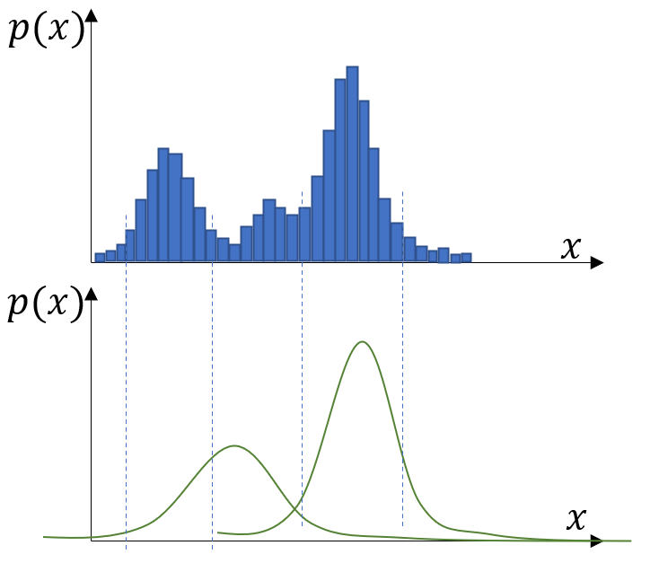
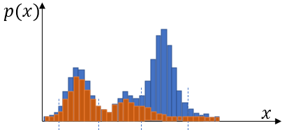

## 高斯混合模型(GMM)

### GMM模型

一些复杂的分布无法用单个高斯函数模型去表述，而是表现为几个高斯函数模型的和。
$$
f(x)=\sum_{i=1}^N w_i \space p(x|\mu_i,\Sigma_i)
$$
利用高斯混合模型拟合样本的问题与高斯在推导正态分布函数时的思路是一样的，高斯在推导时采用的思路即最大化似然函数：$\begin{align} L(\mu)=\prod_{i=1}^N p(x_i|\mu,\sigma)\end{align}$, 当分布函数用$GMM$(Gaussian Mixture Model)表述时，在得到一组样本$\{x_i\}$之后，需要做的同样是最大化似然函数
$$
L(\theta)=\prod_{i=1}^N f(x_i|\theta)
$$
$\theta$是模型的参数，包括多个期望$\mu_1,\mu_2,..,\mu_n$、多个方差$\Sigma_1,\Sigma_2,...,\Sigma_n$以及不同正态分布的权重$w_i$.求解$L(\theta)$的问题是个非凸优化问题，因为假设$w_i$不考虑（$w=\frac{1}{K}$), 则上式变为
$$
\hat{\theta} &= \arg\max_{\theta} \prod_{i=1}^N [\sum_{k=1}^K \frac{1}{K}p(x_i|\theta_k)]\\
&= \arg\max_{\theta} \sum_{i=1}^N \log\{\sum_{k=1}^K p(x_i|\theta_k)\}
$$
这个式子是没有办法用凸优化的理论解的，因此介绍下面的EM算法。

### EM（Expectation-Maximization)算法

鉴于这是一个数据挖掘领域中容易使用的算法，我们在Istatic而非Ioptimize目录下介绍这个算法。我们可以用粒子滤波的思路来理解这个问题，既然是个迭代过程，那么一定有初值 $\mu_0,\Sigma_0$ , 并且可以通过某个标准往后迭代，这个过程是不是很像**粒子滤波的打分+根据打分重采样**？我们不妨直接给出EM算法的具体过程，再看它是为什么可以收敛的。

#### 潜变量

为了引出这个优化问题，引入潜变量$z_k^i$表示**第$i$个样本由第$k$个高斯模型生成的概率**。即$\begin{align} z_k^i = \frac{p_k(x_i|\mu_k,\Sigma_k)}{\sum^K p_k(x_i|\mu_k,\Sigma_k)}\end{align}$, 其中$p_k$表示参数为$\mu_k,\Sigma_k$的高斯函数在$x_i$位置的函数概率密度。则上述的问题在引入了潜变量$z_k^i$后可以进一步表示为：
$$
\hat{\theta} 
= \arg\max_{\theta} \sum_{i=1}^N \log\{\sum_{k=1}^K p(x_i,z_i|\theta_k)\}
$$

#### EM算法步骤

我们注意到，当给定一组$\{\mu_k\},\{\Sigma_k\}$以及样本$\{x_i\}$时，$z_k^i$都是可求的。对于能够忠实刻画$\{\hat{\mu},\hat{\Sigma}\}$的样本，利用 $\{\mu_k\},\{\Sigma_k\}$则会产生偏差。如像下图所示的情况，估计的高一点的分布与样本基本一致，而矮一点的分布则估计的并没有那么准确，

则对于集中在左侧峰的样本，根据$\mu_k,\Sigma_k$计算的$z_1^i,z_2^i$与根据真值算的有所偏差（具体表现就是$z_1^i$被算小了，$z_2^i$被算大了）。

那这时按带有$z_1^i$的权重计算$x_i$从属于各个样本时的期望和方差, 这相当于**样本总量**只有$z_k = \sum_{i=1}^N z_k^i$, 每个样本**对期望的贡献**只有$z_k^ix_i$,**对方差的贡献**也只有$z_k^i(x-\hat{\mu_k})(x-\hat{\mu_k})^T$,（相当于按权重$z_k^i$整体衰了一遍）

> 注意到协方差是按比例衰，切记$z_k^i$是个权重，而不要理解为$z_k^ix_i$作为一个新的随机变量，因为$x_i$的值还是$x_i$，只是由于样本的从属概率是$z_k^i$,所以按比例算贡献就是所有都乘一个$z_k^i$

那么按照上面的说法，$\mu_1,\Sigma_1$对应到下面红色的分布，新的样本的期望和方差近似于下面这个红色的分布的期望和方差。

用这个新的分布对应刻画$\mu_k,\Sigma_k$，则按照这个分布重新计算期望和方差，得到
$$
\begin{align}
\hat{\mu_k} &= \frac{1}{z_k}\sum_{i=1}^N z_k^ix_i\\
\hat{\Sigma_k} &=\frac{1}{z_k}\sum_{i=1}^N z_k^i(x-\hat{\mu_k})(x-\hat{\mu_k})^T\\
z_k &= \sum_{i=1}^N z_k^i

\end{align}
$$
从而实现$\{\mu_k\},\{\Sigma_k\}$的更新。

直观理解为什么这个算法是可以收敛的，即观察上面给出的具体例子，$\mu_1$和$\overline{\mu_1}$有一定偏差，但是对于样本，在$z_1$高的地方样本本来就少，在样本原本的峰值$z_1$虽然比真实估计的要小，但衰减后的样本仍然能保证大头在样本原本的位置，从而更新$\mu,\Sigma$时会往原样本的峰值扳。

则按照上述的方法，将算法写为如下形式：

- 估计$\{\mu_k\},\{\Sigma_k\}$的初值
- 计算$z_k^i$
- 根据$z_k^i$重新计算$\{\hat{\mu_k}\},\{\hat{\Sigma_k}\}$作为更新，则可以重新回退到计算$z_k^i$
- 如此往复，直到$\{\mu_k\},\{\Sigma_k\}$的变化小于阈值，则可以说明算法得到收敛。

#### EM算法的更深层理论（关于收敛）

我们可以利用$jesen$不等式的性质进一步一窥EM算法收敛的本质，$jesen$不等式描述的是凸函数的一般性质，即对于$a_i>0, \sum a_i=1$有
$$
f(\sum a_ip_i)\leq \sum f(a_ip_i)
$$
反之对于对数函数（典型的凹函数）则有
$$
\log(\sum a_ip_i)\geq \sum \log(a_ip_i)
$$
则对于$z_k^i$满足$\sum_{k=1}^K z_k^i=1$, $\sum_{i=1}^N \log\{\sum_{k=1}^K p(x_i,z_i|\theta_k)\}$可以利用$jesen$不等式写成如下的形式：
$$
\sum_{i=1}^N \log\{\sum_{k=1}^K p(x_i,z_i|\theta_k)\} \geq \sum_{i=1}^N\sum_{k=1}^KQ_i(z_i)\log\frac{p(x_i,z_i|\theta_k)}{Q_i(z_i)}
$$
其中$Q_i(z_i)$表示$z_i$的一个概率分布，满足$\sum_zQ_i(z_i)=1$

那么可以发现，$\theta_k$是真实参数，$x_i$是由真实参数生成的样本，对于优化问题实际上是要使$\sum_{i=1}^N\sum_{k=1}^KQ(z_i)\log\frac{p(x_i,z_i|\theta_k)}{Q(z_i)}$这一项越来越大（因为这是目标函数的下界），这一项的值则完全取决于$p(x_i,z_i)$和$Q(z_i)$。

因此一部迭代调整可以理解为让$jensen$不等式取等号。此时凸函数$\frac{p(x_i,z_i|\theta_k)}{Q_i(z_i)}$只能是线性函数, 即$Q_i(z_i)=p(z_i|x_i,\theta_k)$, 因为根据概率统计规律$p(x,y)=p(x|y)p(y)$, 可以写出
$$
p(x_i,z_i|\theta_k)=p(x_i|\theta_k)p(z_i|x_i,\theta_k)
$$
而$p(x_i|\theta_k)$是完全由真实情况决定的常数，与潜变量$z_i$没有关系，从而对$Q$这么取能够使得$\frac{p(x_i,z_i|\theta_k)}{Q_i(z_i)}=const$，即线性函数条件。$p(z_i|x_i,\theta_k)$其实就是相当于用当前样本的分布情况计算$\begin{align} z_k^i = \frac{p_k(x_i|\mu_k,\Sigma_k)}{\sum^K p_k(x_i|\mu_k,\Sigma_k)}\end{align}$, 相当于在$Q_i(z_i)$按照$z_k^i$的潜变量的选取方式，如此更新则能够使得其不等式的下界是在不断网上抬的。目标函数下界的不断上升实际上就相当于在不断地逼近目标函数，这即是DM算法在优化层面上的原理。

